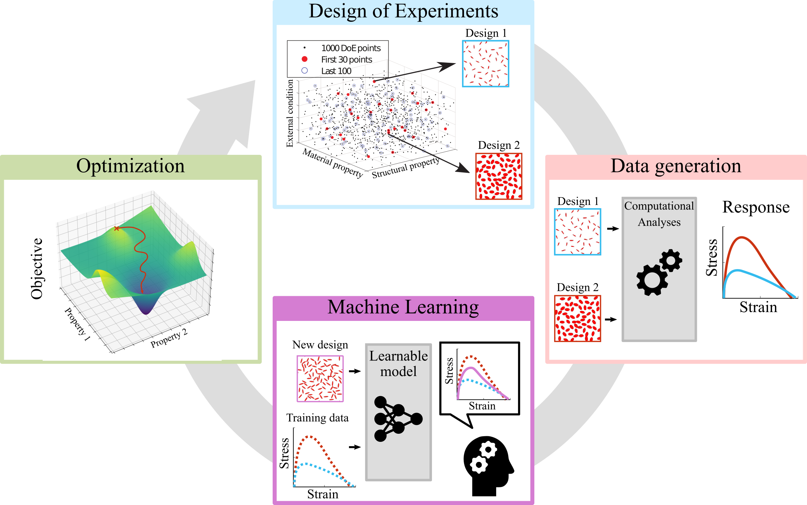

# Summary

[`f3dasm`](https://github.com/bessagroup/f3dasm) (Framework for Data-driven Design and Analysis of Structures \& Materials) is a Python project that provides a general and user-friendly data-driven framework for researchers and practitioners working on the design and analysis of materials and structures. The package aims to streamline the data-driven process and make it easier to replicate research articles in this field, as well as share new work with the community. 

. \label{fig:f3dasm_logo}](f3dasm_logo_long.png)

# Statement of need

In the last decades, advancements in computational resources have accelerated novel inverse design approaches for structures and materials. In particular data-driven methods leveraging machine learning techniques play a major role in shaping our design processes today.

Constructing a large material response database poses practical challenges, such as proper data management, efficient parallel computing and integration with third-party software. Because most applied fields remain conservative when it comes to openly sharing databases and software, a lot of research time is instead being allocated to implement common procedures that would be otherwise readily available. This lack of shared practices also leads to compatibility issues for benchmarking and replication of results by violating the FAIR principles.

In this work we introduce an interface for researchers and practitioners working on design and analysis of materials and structures. The package is called [`f3dasm`](https://github.com/bessagroup/f3dasm) (Framework for Data-driven Design \& Analysis of Structures and Materials) This work generalizes the original closed-source framework proposed by the Bessa and co-workers [@Bessa2017], making it more flexible and adaptable to different applications, namely by allowing the integration of different choices of software packages needed in the different steps of the data-driven process:

- **Design of experiments**, in which input variables describing the microstructure, properties and external conditions of the system are determined and sampled.
- **Data generation**, typically through computational analyses, resulting in the creation of a material response database.
- **Machine learning**, in which a surrogate model is trained to fit experimental findings.
- **Optimization**, where we try to iteratively improve the design

\autoref{fig:data-driven-process} provides an illustration of the stages in the data-driven process. 

[`f3dasm`](https://github.com/bessagroup/f3dasm) is an [open-source Python package](https://pypi.org/project/f3dasm/) compatible with Python 3.8 or later. The library includes a suite of benchmark functions, optimization algorithms, and sampling strategies to serve as default implementations. Furthermore, [`f3dasm`](https://github.com/bessagroup/f3dasm) offers automatic data management for experiments, easy integration with high-performance computing systems, and compatibility with the hydra configuration manager. Comprehensive [online documentation](https://f3dasm.readthedocs.io/en/latest/) is also available to assist users and developers of the framework.

# Acknowledgements

We would express our gratitude to Jiaxiang Yi for his contributions to writing an interface with the ABAQUS simulation software.

# References